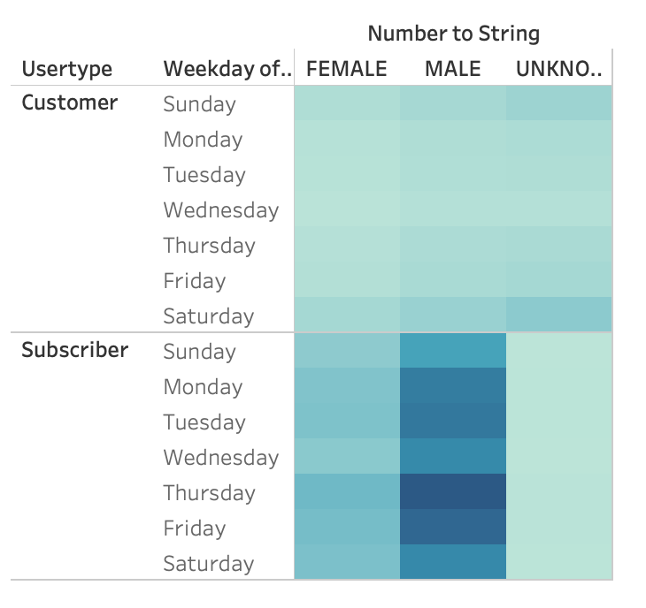

# Des Moines Bike Sharing Analysis
## Overview
### Purpose
The purpose of this analysis is to show the data of CitiBike in New York City and to see if starting a bike sharing business in Des Moines, Iowa would be a possibility. Using this data can help show what hours are the most popular, what locations could be the most popular for Des Moines, and the most popular user types. 
#### Link to Tableau Story
[link to dashboard](https://public.tableau.com/profile/peyton5401#!/vizhome/Citibike_Challenge_16040885478750/Citibike?publish=yes)

## Results
### Top Starting Locations
In NYC, these are the top starting locations for the CitiBikes. These locations could be close to hotels, tourist spots, or popular locations in NYC. Using this data, we can figure out to place the bike stations in Des Moines near hotels and tourist spots. 

###### Figure 1

### Top Ending Locations
In NYC, these are the top ending locations for the CitiBikes. These locations could be close to hotels, tourist spots, or popular locations in NYC. Using this data, we can figure out to place the bike stations in Des Moines near hotels and tourist spots to increase chances of people using our service. 
###### Figure 2

### Peak Checkout Hours
In figure 3, we can see the peak checkout hours of the bikes in New York. The peak checkout hours are at 5 PM, which is the end of the work day so it makes sense that the bikes are used the most after work, so if we can do maintance to the bikes before or after 5 PM, that would be the most optimal time of the day.

###### Figure 3

### Peak Checkout Hours for Genders
In figure 4, we can see that the male population of the data checks out the most bikes at 5PM after work. Again, if we do maintance at night, we can optimaze bike checkouts. 

###### Figure 4

### Trips by Weekdays
As we can see in figure 5, Thursday's at 6 PM are the most popular times to end the ride of bikes. If we can have the bikes in optimal condition before 5, again we optimize sales and checkout. 

###### Figure 5

### Trips by Weekdays by Gender
There's a trend of male users having the most bike trips. It makes sense that they have the most checkout times. 

###### Figure 6

### User Types
The user types with the most bike rides are male subscribers. In Des Moines, if we can advertise a deal for being subscriber, I believe we can optimize sales.

###### Figure 7

## Summary
In summary, if we can put the bike stations in tourist areas and near hotels in Des Moines, we can the have best opportunity of having a successful bike sharing service. For the bikes who need maintance, we would need to commit it during the non-peak hours of later at night.
